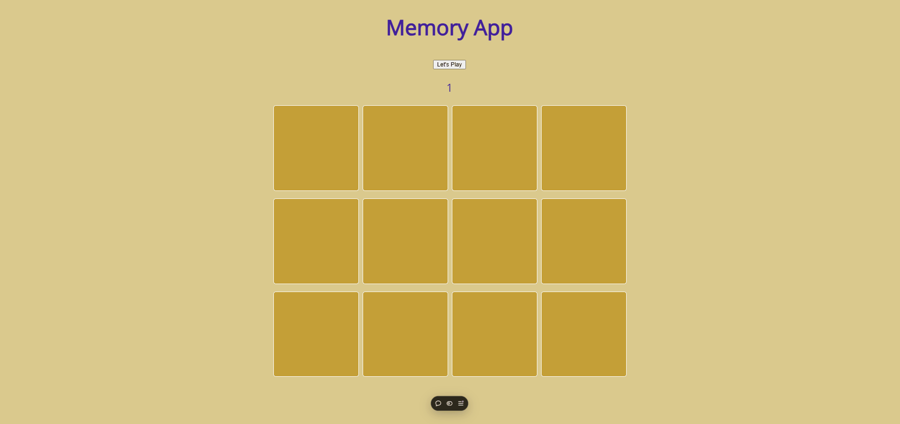

# Memory Game App 🎮

<div align="center">
  <h2>
    👉 <a href="https://memory-app-seven.vercel.app/">Live Demo</a> 👈
  </h2>
</div>

<div align="center">
  
</div>

## 📌 About The Project

A challenging and entertaining memory card game built with React. Players can test and improve their memory skills with an interactive interface featuring card matching mechanics and score tracking.

### ✨ Key Features

- 🎴 Interactive card matching gameplay
- 🔄 Card rotation animations
- 🎯 Score tracking system
- 🔀 Random card shuffling
- 📱 Responsive and mobile-friendly
- 🎨 Sleek and modern UI
- 🎮 Simple one-click restart

### 🛠️ Built With

- [React](https://reactjs.org/)
- [React Hooks](https://reactjs.org/docs/hooks-intro.html)
- CSS3 with Animations

## 🚀 Getting Started

```bash
# Clone the repository
git clone https://github.com/caneryesiltas/memory-game.git

# Navigate to project directory
cd memory-game

# Install dependencies
npm install

# Start the development server
npm start
```

## 💻 Project Structure

```
src/
├── components/
│   └── MemoryCard.js    # Individual card component
├── styles/
│   └── App.css          # Styling and animations
└── App.js               # Main game logic
```

## 🔍 Core Functionality

- **Card Management**: Dynamic card generation and state handling
- **Match Detection**: Automatic pair matching system
- **Score Tracking**: Round-based score counting
- **Game Reset**: One-click game restart
- **Animation**: Smooth card flip animations

## 🎯 Component Details

### MemoryCard Component
- Card flip animation
- Click handling
- Match state management
- Dynamic image loading

### App Component
- Game state management
- Card shuffling logic
- Score tracking
- Match validation

## 📱 Responsive Design

- Fluid grid layout
- Touch-friendly interface
- Responsive card sizing
- Cross-device compatibility

## 🎮 Game Logic

- Cards are randomly shuffled at game start
- Players can flip two cards at a time
- Matched pairs remain visible
- Unmatched pairs flip back
- Score increments with each attempt
- Game can be reset at any time

## 🤝 Contributing

Contributions make the open source community an amazing place to learn, inspire, and create. Any contributions you make are **greatly appreciated**.

## 📄 License

Distributed under the MIT License. See `LICENSE` for more information.

## 📫 Contact

Your Name - youremail@example.com

Project Link: [https://memory-app-seven.vercel.app/](https://memory-app-seven.vercel.app/)

---

<div align="center">
  Made with ❤️ by [Your Name]
</div>